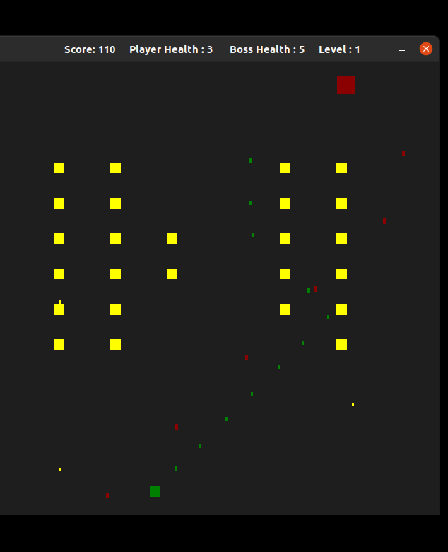
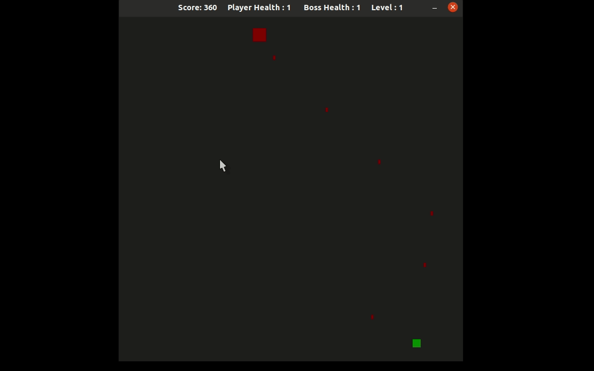
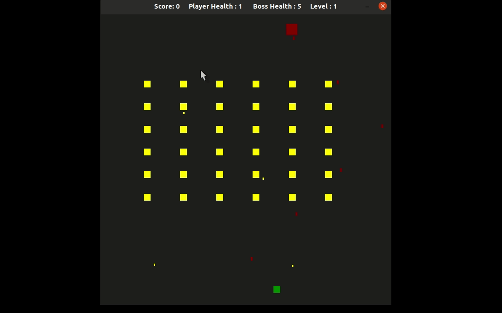

## Shooter

### Author: 
Vishwajeet Karmarkar <br>
vishwajeet@u.northwestern.edu




This is a replica of the classic Space Shooter game written in C++. The aim of the game is to shoot all the enemies while avoiding their bullets. There are 10 levels 
with increasing difficulty! <br>

To Start the game run the executable called Shooter after compiling the code (instructions for compiling given below ) <br>

```
./Shooter
```

Controls : Use the left and right arrow key to move the player around. To shoot bullets use the Spacebar <br>

<br>
<br>


Structure : <br> <br>
The src folder contains all the source c++ files, the include folder the corresponding header files. <br> 
The cmake folder houses .cmake scripts useful to locate the SDL add-on libraries. 


To play the game 


Clone the Repo 
```
git clone https://github.com/vishwajeet-NU/Space_Shooter.git

```
## Dependencies for Running Locally
* cmake >= 3.7
  * All OSes: [click here for installation instructions](https://cmake.org/install/)
* make >= 4.1 (Linux, Mac), 3.81 (Windows)
  * Linux: make is installed by default on most Linux distros
  * Mac: [install Xcode command line tools to get make](https://developer.apple.com/xcode/features/)
  * Windows: [Click here for installation instructions](http://gnuwin32.sourceforge.net/packages/make.htm)
* SDL2 >= 2.0
  * All installation instructions can be found [here](https://wiki.libsdl.org/Installation)
  * Note that for Linux, an `apt` or `apt-get` installation is preferred to building from source.
* gcc/g++ >= 5.4
  * Linux: gcc / g++ is installed by default on most Linux distros
  * Mac: same deal as make - [install Xcode command line tools](https://developer.apple.com/xcode/features/)
  * Windows: recommend using [MinGW](http://www.mingw.org/)


To compile 

``` 
mkdir build 
cd build
cmake ..
make
```






Rubrics Covered <br>

1) Loops, Functions, I/O : All points covered across the codebase <br>
2) Object Oriented Programming points covered <br>
* 1
* 2   
* 3
* 5
* 6 
* 7
* 8
3) Memory Management  points covered <br>
* 1
* 2
* 3
